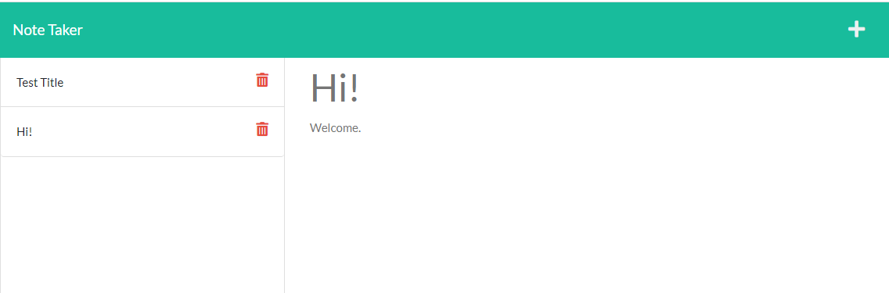

# Note Taker

## Description
* This application uses Node.js and Express.js. The user is enabled to type in notes, save them, and delete them.

## Table of Contents
* [Installation](#installation)

* [Usage](#usage)

* [Contributors](#contributors)

* [License](#license)

* [Badges](#badges)

## Installation
* To use this application, you must clone the repo and install the dependencies using npm install. From here, you can start the server.

## Usage
* The server can be invoked using npm start. From here, the user will be enabled to add, save, or delete notes.

* This repository can be opened as an HTML within Github at the website: https://github.com/Teeemster/Team-Profile-Generator

## Contributors
* Jay Beach
* University of Arizonia

## License
* This application is covered under GPL v2.

## Badges

* 
* 
* 
* 